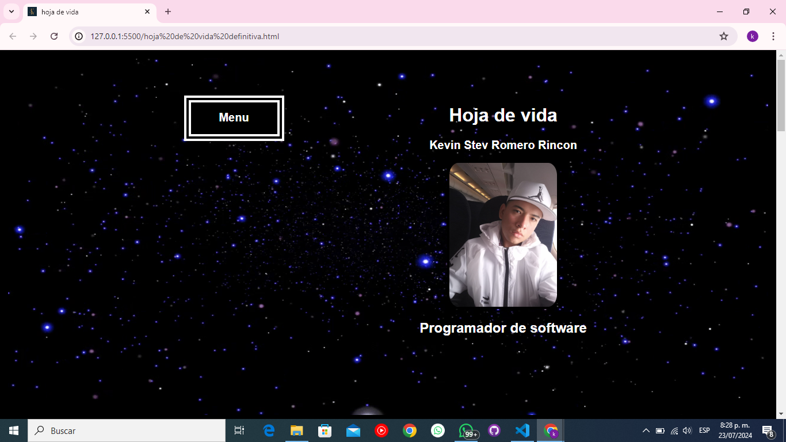

# Hoja de Vida
Esta hoja de vida cuenta con toda la infomacion sobre como: Experiencia, Educacion, Habilidades, Idiomas y Contactos

## Tabla de contenidos
| Indice | Titulo  |
|--|--|
| 1 | Experiencia 1 |
| 2 | Educacion 2 |
| 3 | Habilidades 3 |
| 4 | Idiomas 4 |
| 5 | Contactos 5 |
| 6 | Contactame 6 |

### Instalaciones 
Deberas ejecutar este comando para descargar 

```bash
sudo apt install app https://github.com/Kevinromero04/Hoja-de-vida.git
```


# Tecnoogias  💻
- Html 
- Css

  
### Visualizacion



Hecho por [Kevin_Romero](https://github.com/Kevinromero04)

>Kevin Romero Rincon..

